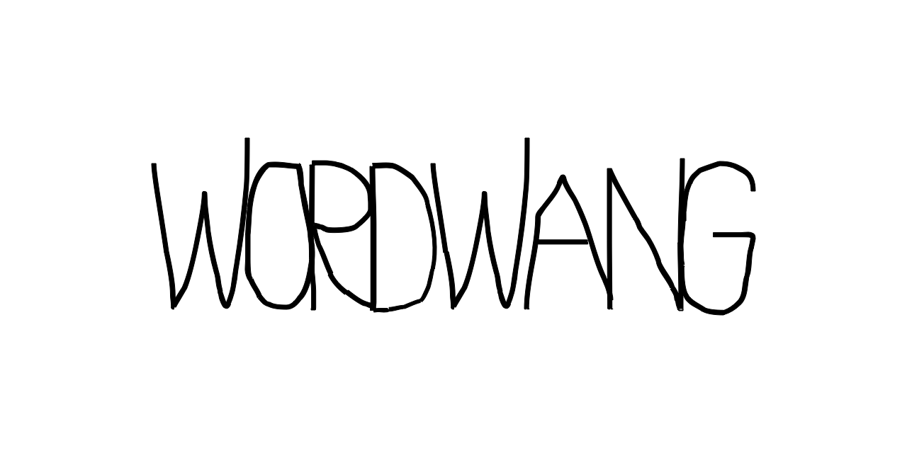

<p>
  
</p>
<h1 align="center">
  Welcome to wordwang 👋
</h1>
<!--<p>
  
  <a href="#" target="https://github.com/ehne/leven/blob/master/LICENSE.md">
    
  </a>
</p>-->

> A language-agnostic word-based esoteric programming language based off [Wang's B-machine](https://en.wikipedia.org/wiki/Wang_B-machine)

> view the demo & run your own wordwang programs at [https://darcylf.me/wordwang](https://darcylf.me/wordwang)

A program in wordwang consists of a string of words with spaces between them, and sometimes an exclamation point between two words and no space. 

At each instruction/word in the program, the square root of the sum of the number of letters in the word and the instruction number is taken `(math.sqrt(noOfLetters + instNumber))`. then the resulting (rounded) modulo 4 determines what instruction to follow. 

| Wordwang has 4 instructions |  |
| --- | --- |
| 0 | flip the value of the current position of the tape-head (0->1, 1->0) |
| 1 | move the tape-head right |
| 2 | move the tape-head left |
| 3 (requires "!" and then another word "n" letters long) | if the current tape position has a 1 then go to instruction n-1, else continue to next instruction |

an example program: ```extraterrestrial yes perfect!ok aanrijdingsformulier no```

this then compiles into: `0 1 3!2 1 2`

which means the program will execute as follows:
* step 0: (extraterrestrial) flips the current position of the tape-head (position 0).
* step 1: (yes) moves the tape-head right, to position 1.
* step 2: (perfect!ok) checks if the current position (1) of the tape-head has a 1. It does not, it then moves to the next instruction.
* step 3: (aanrijdingsformulier) moves the tape-head right, to position 2.
* step 4: (no) moves the tape-head left, to position 1.


A wordwang program will always start with a set length tape of zeros, with the tape-head starting on position zero. The first instruction of the program is instruction zero.

**IMPORTANT:** The tape head can move to positions that are outside of the range of the tape. So, in a length-10 tape the tape-head can move to -1, -2, -3, etc... and 11, 12, 13, etc... **However**, the tape-head cannot write to these positions.

### Programs:
**Alternating values:**
* input: `cool a autoschadehersteller International beanie!Ik`
* output: `[0, 1, 0, 1, 0, 1, 0, 1, 0, 1]`

**Truth Machine:**
* input: `cool!k`
* output: `[0]`

---

> no, i do not know a good way to program things in wordwang.

> yes, i'm pretty sure wordwang is turing-complete. 
 
> made by darcylf in 2020
